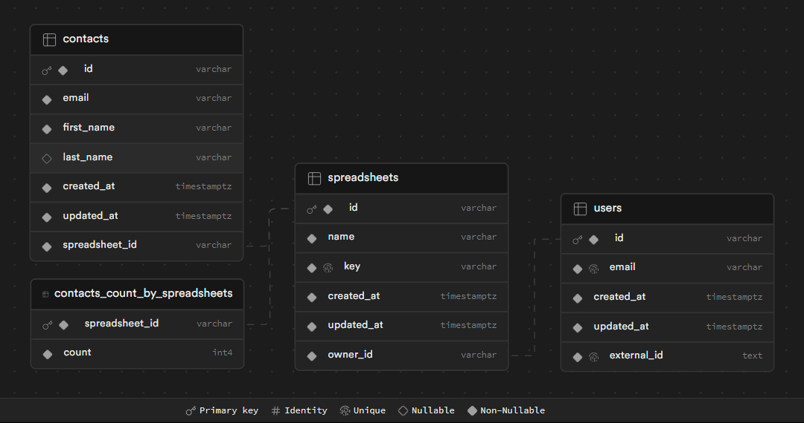
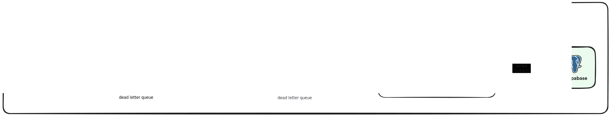
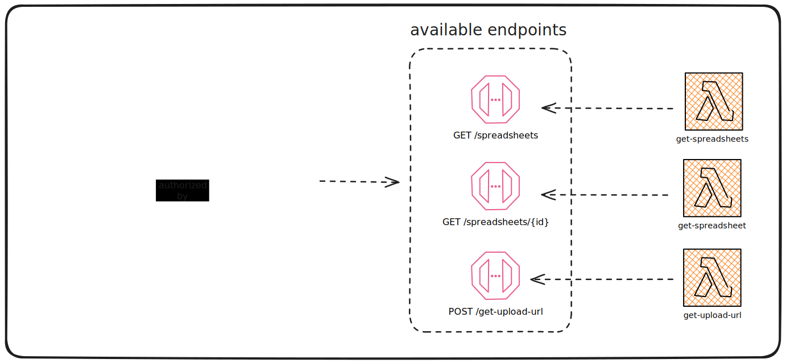

# Sheets Server

Server infrastructure for Sheets.

## Table of Contents

- [Introduction](#introduction)
- [Decision process](#decision-process)
  - [File upload](#file-upload)
  - [Spreadsheet processing](#spreadsheet-processing)
  - [API Gateway](#api-gateway)
  - [Database](#database)
  - [Authentication](#authentication)
- [Workflow](#workflow)
  - [Process uploaded spreadsheet](#process-uploaded-spreadsheet)
- [Available endpoints](#available-endpoints)
- [Package commands](#package-commands)
- [Tools used](#tools-used)
- [Room for improvements](#room-for-improvements)

---

## Introduction

The Sheets Server is a serverless application that provides a REST API to manage spreadsheets and their contacts. The infrastructure relies on AWS services such as S3, Lambda, SQS, and API Gateway. The application is built using TypeScript and deployed using AWS CDK.

The main objective of the Sheets Server is to be a BFF (Backend-for-Frontend) for the [Sheets App](https://github.com/jhonnymoreira/sheets-app).

All the endpoints are protected by a custom authorizer on the API Gateway that verifies the user's JWT token generated by [Clerk](https://clerk.dev/) on client-side.

---

## Decision process

Keep in mind that the decisions were made based on a low-cost solution that is easy to maintain and scale, while still providing the needs to meet the requirements of the challenge (500k contacts per spreadsheet).

### File upload

The file upload relies on the [AWS S3 Presigned URLs](https://docs.aws.amazon.com/AmazonS3/latest/userguide/PresignedUrlUploadObject.html) feature to generate a signed URL that can be used to upload the file to S3.

The URL expiration time is 10 minutes, which is enough to avoid the token expiration when the user network is slow and needs to upload a large file (we only support files up to 200 MB).

To make it available to the `sheets-app`, there is an endpoint on API Gateway that generates the signed URL to the user (`POST /get-upload-url`).

### Spreadsheet processing

The spreadsheet processing has the following requirements:

- 1 [AWS S3](https://aws.amazon.com/s3/) bucket to store the processed spreadsheets.
- 4 [AWS SQS](https://aws.amazon.com/sqs/) queues:
  - [AWS SQS Standard](https://docs.aws.amazon.com/AWSSimpleQueueService/latest/SQSDeveloperGuide/standard-queues.html) with a dead letter queue, to store the S3 Events emmited by the S3 bucket upon object creation.
  - [AWS SQS FIFO](https://docs.aws.amazon.com/AWSSimpleQueueService/latest/SQSDeveloperGuide/sqs-fifo-queues.html) with a dead letter queue, to store the processed contacts and guarantee that duplicates are not sent to the consumer.
    > FIFO (First-In-First-Out) queues have all the capabilities of the standard queues, but are designed to enhance messaging between applications when the order of operations and events is critical, or where duplicates can't be tolerated.
- 2 [AWS Lambda](https://aws.amazon.com/lambda/) functions:
  - One to consume the S3 Events Queue and process the spreadsheets (validate, remove duplicates, split into chunks, and produce events to the processed contacts queue).
  - One to consume the processed contacts queue and write the data to the database. This lambda will be concurrent and has the max concurrency set to 10.

### API Gateway

The API Gateway is also AWS-based and has the following requirements:

- 4 [AWS Lambda](https://aws.amazon.com/lambda/) functions:
  - One to act as the custom authorizer to verify the user's JWT token generated by [Clerk](https://clerk.dev/) on client-side.
  - Three to handle the endpoints:
    - `GET /spreadsheets`: Get a list of all spreadsheets from a given user.
    - `GET /spreadsheets/{id}`: Get the spreadsheet contacts by the spreadsheet `id` matching for a given user.
    - `POST /get-upload-url`: Get a signed URL to upload a spreadsheet to S3 by providing a `displayName` and `fileSize`.
- CORS configuration to allow the `sheets-app` to make requests to the endpoints.

### Database

The database is a PostgreSQL service-based instance on [Supabase](https://supabase.com/). The free tier is enough to handle the requests of the `sheets-app`, but the paid tier is recommended to increase the performance, since the free tier has only 2 Core CPUs and 1 GB of RAM.

To ensure the interaction with the database has some type-safety, the database is managed by [Drizzle ORM](https://orm.drizzle.team/) using [Postgres.js](https://github.com/porsager/postgres) as the PostgreSQL driver.

The database has the following schema:

The extra table `contacts_count_by_spreadsheets` is used to store the count of contacts per spreadsheet, which helps to avoid long-duration queries when paginating the spreadsheets contacts.

### Authentication

The authentication is done by [Clerk](https://clerk.dev/) on client-side. The main decision was to experiment with the service and see how it works, but it is not a requirement to use it.

---

## Workflow

The workflow is divided into the following steps:

1. The user fills the upload form in `sheets-app`
1. When submitting the form, the it is generated a signed URL to upload the file to S3
1. The signed URL is sent back to the user with some metadata to ensure the file is correctly processed
1. When the user finishes the file upload, the S3 bucket responsible for storing the files emits an event to the queue (`spreadsheets-to-process`)
1. The queue is processed by a consumer lambda (`process-spreadsheets`) that validates the file iterating over the rows, validating andremoving the duplicated rows, and then splitting the file into chunks of 500 rows to send to another queue (`processes-contacts`)
1. The lambda `insert-spreadshees-contacts` consumes the `process-contacts` and writes the data to the database. This lambda is concurrent and has the max concurrency set to 10
1. When the data is written to the database, after each row insertion in `contacts` table, it triggers a database function that writes to `contacts_count_by_spreadsheets` table by incrementing the `count` by `spreadsheet_id`, avoiding long-duration queries to return the contacts count when the spreadsheet is exhibited to the user.

### Process uploaded spreadsheet

Once the spreadsheet is created, it is processed by the server in the following steps:

---

## Available endpoints

### Endpoints description

- `POST /get-upload-url`: Get a signed URL to upload a spreadsheet to S3 by providing a `displayName` and `fileSize`. The endpoint is guarded.
- `GET /spreadsheets`: Get a list of all spreadsheets from a given user. The endpoint is guarded.
- `GET /spreadsheets/{id}`: Get the spreadsheet contacts by the spreadsheet `id` matching for a given user. The endpoint is guarded.

---

## Package commands

For `drizzle-kit` commands, see the [drizzle-kit documentation](https://orm.drizzle.team/kit-docs/commands).

- `deploy:development`: Deploys the main app stage to the development environment
- `deploy:staging`: Deploys the main app stage to the staging environment
- `deploy:production`: Deploys the main app stage to the production environment
- `db:check`: A wrapper around `drizzle-kit check:pg`
- `db:introspect`: A wrapper around `drizzle-kit introspect:pg`
- `db:migration:down`: A wrapper around `drizzle-kit drop`
- `db:migration:generate`: A wrapper around `drizzle-kit generate:pg`
- `db:migration:up`: A wrapper around `drizzle-kit up:pg`
- `db:push`: A wrapper around `drizzle-kit push:pg`
- `lint`: Runs ESLint on the project
- `prepare`: Hook command to setup `husky` and `lint-staged`
- `prettify`: Prettify the project using Prettier
- `test`: Run `vitest`
- `test:watch`: Run `vitest` with `--watch` flag
- `test:coverage`: Run `vitest` with `--coverage` flag

---

## Tools used

- **Language**: JavaScript with [TypeScript](https://www.typescriptlang.org/) and running on [Node.js](https://nodejs.org/) via [AWS Lambda](https://aws.amazon.com/lambda/)
- **Infrastructure as Code**: [AWS CDK](https://aws.amazon.com/cdk/)
- **Database**: [PostgreSQL](https://www.postgresql.org/) via [Supabase](https://supabase.com/) with [Drizzle ORM](https://orm.drizzle.team/) using [Postgres.js](https://github.com/porsager/postgres) as the PostgreSQL driver.
- **Queues**: [AWS SQS](https://aws.amazon.com/sqs/) (FIFO and Standard)
- **File storage**: [AWS S3](https://aws.amazon.com/s3/)
- **Authentication**: [Clerk](https://clerk.dev/) to handle user authentication and authorization, verified on API Gateway authorizer with [jose](https://github.com/panva/jose)
- **Testing**: [Vitest](https://vitest.dev/)
- **Code quality tools**: [ESLint](https://eslint.org/) (with flat config) and [Prettier](https://prettier.io/) (with few plugins to inforce a consistent code style).
- **Validation**: [zod](https://github.com/colinhacks/zod) for type-safe validation.
